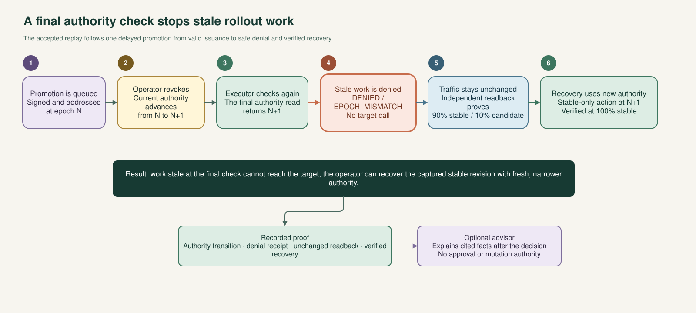

# ControlGraph Canary

**Stop stale rollout authority before it changes Cloud Run traffic.**

A queued action can be valid when it is approved and wrong when it finally runs. After claiming
the exact execution receipt, the executor performs a fresh authoritative read of the rollout
root's current epoch immediately before the target-bound mutation adapter. The signed epoch must
match exactly. Stale, future, missing, or unreadable authority stops the action before the adapter
is called. A separate verifier then records what actually happened.

ControlGraph applies this rule to one focused canary workflow: capture a stable revision, move
traffic to a 90/10 split, evaluate fixed health rules, and either promote the candidate or restore
the captured stable revision. After a deterministic outcome, Gemini 3.5 Flash on Vertex AI is
coordinated by Google ADK through six fixed read-only tools: Rollout root, Target state, Health
evidence, Execution receipt, Evidence timeline, and Independent verifier. Its output is advisory
and never participates in authority, health, dispatch, recovery, or mutation decisions.



## What ControlGraph adds

- **Revocable approval:** an epoch is a version of rollout authority. Advancing it invalidates
  work issued under an older epoch.
- **A last-mile check:** the executor reads the current epoch immediately before it calls the
  target-bound traffic adapter.
- **Narrow execution:** signed capabilities bind one caller, target, action, traffic plan,
  precondition, request, and lifetime.
- **Independent verification:** a separate read-only path checks configuration and data-path
  evidence before the system reports a verified outcome.
- **Useful AI without AI authority:** Gemini 3.5 Flash on Vertex AI, coordinated by Google ADK
  through those six fixed read-only tools, organizes cited evidence only after the deterministic
  outcome. It has no decision or mutation role.

## See the verified replay

Open the credential-free
[Live-hosted demo — Verified Replay](https://controlgraph-console-936681471311.us-central1.run.app/replay)
to inspect recorded evidence from the **Accepted stale-authority run**. The sequence shows:

1. valid promotion work queued under epoch N;
2. an operator advancing authority to N+1;
3. the executor's final fresh read finding N+1 and rejecting the epoch-N action with
   `DENIED / EPOCH_MISMATCH` before the mutation adapter is called;
4. independent readback confirming that traffic stayed at 90/10;
5. a cited, advisory-only Gemini result recorded after that deterministic outcome; and
6. new, current-epoch recovery authority restoring 100 percent stable traffic.

The replay validates its artifact, schema, payload, case bindings, and event chain before it
renders. The accepted artifact's source revision is
`dcc2192dade08d3fdfd27daded0ccfdd13193fd1`. The separately deployed viewer may run a newer
revision; it does not change the artifact's source identity. This is recorded evidence, not a live
control surface. Cloud KMS signatures are verified in the authenticated evidence path, not in the
browser.

## How the design stays small

ControlGraph separates four responsibilities:

1. **Approve:** the operator approves one immutable rollout root and its current epoch.
2. **Execute:** a target-bound executor accepts only a valid capability at that exact epoch.
3. **Verify:** a separate reader compares intent, receipts, configuration, and probe results.
4. **Explain:** after the deterministic outcome, the timeline and optional advisor present
   recorded facts without entering authority, health, dispatch, recovery, or mutation decisions.

Cloud Run remains the serving and traffic control plane. Firestore stores authority and receipts,
Cloud KMS signs capabilities and selected evidence, Cloud Tasks carries addressed work, and Cloud
Monitoring supplies health observations. ControlGraph connects those native controls around the
execution-time authority decision.

## Quick start

### Backend

```bash
cd backend
uv sync --all-extras --dev
uv run pytest
uv run controlgraph-canary doctor
uv run controlgraph-canary serve
```

Every controller exposes identity-safe `GET /healthz` and `GET /v1/metadata` endpoints. Protected
routes still require their full caller, capability, root, epoch, receipt, and target bindings. A
local start does not bypass those checks.

### Web console

```bash
cd web
npm ci
npm test -- --run
npm run dev
```

### Terraform

```bash
terraform -chdir=infra fmt -check -recursive
terraform -chdir=infra/bootstrap init -backend=false
terraform -chdir=infra/bootstrap validate
terraform -chdir=infra/foundation init -backend=false
terraform -chdir=infra/foundation validate
terraform -chdir=infra/runtime init -backend=false
terraform -chdir=infra/runtime validate
```

Terraform accepts immutable container references in the form `...@sha256:...`. Applying a plan is
an explicit operator action. The console never applies infrastructure.

## Read by goal

| Goal | Start here |
|---|---|
| Understand the solution and its boundaries | [Architecture](docs/architecture.md) |
| Watch the complete stale-authority story | [Evidence-backed demo](docs/demo.md) |
| Reproduce the local or hosted workflow | [Canary quickstart](docs/quickstart.md) |
| Review exact states, records, and outcomes | [Product contract](docs/product-contract.md) |
| Evaluate security assumptions and controls | [Threat model](docs/threat-model.md) and [security policy](SECURITY.md) |
| Compare the design with native Google Cloud controls | [Native-cloud comparison](docs/native-cloud-comparison.md) |
| Operate or investigate the system | [Operations runbooks](docs/runbooks.md) |
| Review source origin and durable choices | [Provenance](docs/provenance.md) and [architecture decisions](docs/decisions/) |

## Repository layout

```text
backend/  Authority kernel, application services, Google adapters, API, CLI, and tests
web/      Operator evidence console, epoch-revocation control, public replay, and contract checks
infra/    Isolated Google Cloud environment and service modules
docs/     Architecture, product contract, evidence, operations, and provenance
```

## Security posture

- Each rollout root has its own monotonically increasing epoch.
- Capabilities succeed only when their signed epoch is current and every other binding matches.
- Authority code cannot import HTTP, cloud, model, or agent-framework packages.
- Mutation adapters are fixed to one target and a closed traffic operation.
- Health decisions are deterministic and signed.
- Recovery can select only the stable revision captured by the rollout root.
- Provider uncertainty remains `AMBIGUOUS` until exact readback resolves it.
- The console has no direct cloud-control-plane access.

ControlGraph is pre-release software for the documented reference boundary. See the
[architecture](docs/architecture.md) and [threat model](docs/threat-model.md) for the complete
security model.

## Development

Run the same checks as CI:

```bash
cd backend && uv sync --all-extras --dev && uv run ruff check . && uv run mypy src && uv run pytest
cd web && npm run typecheck && npm test -- --run && npm run build
terraform -chdir=infra fmt -check -recursive
terraform -chdir=infra/bootstrap init -backend=false && terraform -chdir=infra/bootstrap validate
terraform -chdir=infra/foundation init -backend=false && terraform -chdir=infra/foundation validate
terraform -chdir=infra/runtime init -backend=false && terraform -chdir=infra/runtime validate
python scripts/check_clean_room.py
```

## License

Apache License 2.0. See [LICENSE](LICENSE).
