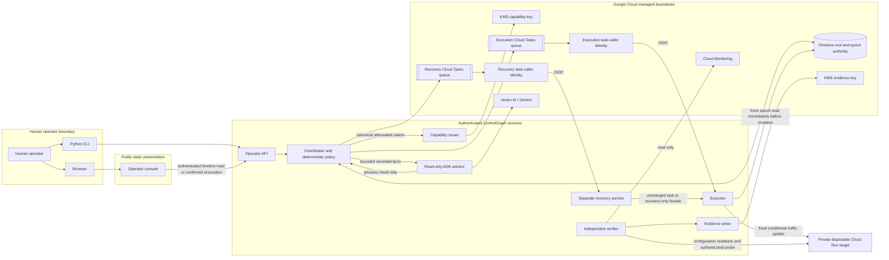

# Architecture

## Purpose and implementation posture

ControlGraph Canary addresses stale authority at execution time. A request can be correctly
authenticated, correctly signed, and intact yet no longer be authorized because it was queued
before an operator revoked its rollout epoch.

The repository implements strict versioned contracts, cross-language canonical fixtures, a pure
rollout reducer, root-scoped exact-match epochs, transactional Firestore authority and receipt
adapters, purpose-separated KMS signing and verification, sealed Cloud Tasks delivery,
target-bound Cloud Run mutation and readback, deterministic Monitoring health evaluation,
healthy promotion, and captured-stable recovery. Terraform defines the isolated cloud substrate,
and the static React console renders the operator timeline and submits only the explicitly
confirmed epoch-revocation command through the API. A bounded ADK/Gemini advisor reads recorded
facts but has no mutation authority. The published credential-free replay binds one accepted
hosted run to its exact source, immutable images, manifest, cases, and redacted event chain.

## Trust boundaries and control path



Arrows show authenticated requests or bounded data flow, not transferable authority. Firestore is
the root-scoped epoch authority. KMS keys are purpose-separated. The two queues have different
handlers and caller identities. Only the executor's target-bound adapter can update traffic, and it
must repeat the authority check at execution time. Recovery validates stable-only work in its own
service and forwards the unchanged task to the executor's recovery-only facade. Verification reads
Cloud Run configuration, Monitoring, and the target data path independently of mutation.

After a verified 90/10 apply, the verifier derives the two fixed candidate-revision Monitoring
queries from the immutable root, canonicalizes bounded results, applies the frozen policy, and
obtains a signed health proof. Consecutive healthy windows authorize the normal promotion path.
A terminal unhealthy proof is stored atomically with one root-owned recovery intent and then
drives the separately addressed recovery path.

No model appears in the authority or mutation path. The optional Gemini/ADK integration consumes
six narrow, read-only diagnostic tools. Its bounded output cannot approve authority, classify
health, select a rollout or recovery action, enqueue protected work, or call a mutation adapter.

## Proof protocol and causal boundary

The implemented proof protocol connects five independently reviewable layers:

1. Cloud Run configuration and probe observations, Firestore authority and receipt records, and
   Cloud Monitoring samples are captured under closed versioned contracts.
2. Pure reducers classify authority, health, execution, recovery, and uncertain provider outcomes.
   An outcome that cannot be distinguished by exact readback remains `AMBIGUOUS`.
3. One canonical request can acquire one directly confirmed, process-local dispatch lease. Its
   durable receipt rejects conflicting reuse and prevents replay from reconstructing mutation
   authority.
4. Selected authority, health, and independent-verification evidence and capabilities are signed
   through purpose-separated Cloud KMS keys. Other effects remain bound by canonical digests,
   receipts, provider readback, and the hash-linked timeline rather than being described as
   individually signed.
5. Gemini 3.5 Flash, invoked by Google ADK, uses six read-only tools to derive a structured,
   evidence-backed causal path. Required receipt, timeline, and target or verifier citations are
   validated before the result is recorded as `ADVISORY_ONLY`; the result never enters a
   deterministic decision path.

This is a causal path over named observations, not a general-purpose causal graph. The protocol
does not invent competing histories when evidence is incomplete: it preserves the explicit
deterministic outcome and the evidence needed for an operator to investigate it.

## Layering and dependency direction

The Python implementation is divided by authority rather than by cloud product:

```text
HTTP services / CLI / composition roots
             |                  |
             |                  v
             |          Google integrations
             |          Firestore, KMS, OIDC,
             |          Cloud Tasks, Cloud Run
             |                  |
             +---------> application facade and ports
                                      |
                         +------------+------------+
                         v                         v
                  versioned contracts       authority kernel
                                            reducer, epoch,
                                            policy, replay rules
```

The authority kernel is pure Python and imports no HTTP framework, Google Cloud SDK, model SDK,
ADK, or agent framework. Boundary contracts may use narrowly selected validation dependencies,
but cloud and transport types do not enter domain decisions. Integrations depend inward through
application ports; the authority and application layers never import an integration.

Optional agent integrations belong under `integrations/` and receive no mutation-capable facade.

## Domain records

The contracts contain exact, versioned records for:

- project, region, environment, and service target binding;
- stable service snapshot and provider precondition;
- immutable rollout root and content digest;
- root-scoped epoch authority and monotonic transitions;
- capability claims, signatures, lineage, and attenuation;
- mutation intent and addressed task request;
- execution receipt and ambiguity classification;
- Monitoring queries, canonical observations, health decisions, and signed proof chains;
- recovery intent, prestate, authorization, dispatch, and addressed task; and
- ordered evidence events.

The complete vocabulary and terminal semantics are defined in `product-contract.md`.

## Canonical wire boundary

Every object crossing a language, process, persistence, or trust boundary has one exact schema
version and bounded canonical representation. Signed and hashed content uses deterministic UTF-8
JSON, duplicate-key rejection, explicit timestamp and number rules, unknown-field rejection, and
domain-separated digests. Parsing untrusted input never chooses a key, algorithm, URL, resource,
or method.

Python and TypeScript may share golden fixtures for representation and display, but TypeScript
never becomes an authority implementation. The server remains the source of mutation decisions.

## Epoch authority

Each immutable rollout root begins at epoch 1 and has an independent, monotonically increasing
epoch.
Authority changes compare an expected current epoch and advance it exactly once while recording
the actor, cause, request identity, prior epoch, new epoch, and evidence identity.

Exact equality is required:

- signed epoch lower than current: the work is stale;
- signed epoch higher than current: the authority view or request is inconsistent;
- exact match: epoch validation succeeds, subject to every other gate.

Epochs are never inferred from time, shared between roots, decremented, or reused. Queue admission,
issuance, and an earlier process check cannot substitute for a strongly consistent authority read
immediately before mutation. Failure to read or validate current authority denies the operation.

## Immutable roots and attenuation

A rollout begins with two matching reads of an eligible 100 percent stable target. The snapshot
records exact immutable revisions, traffic, approved concurrency, service generation or etag, and
a canonical configuration digest. A canonical service claim permits at most one active root for
the project, region, environment, and service.

Root creation atomically binds the stable snapshot, candidate, 90/10 plan, deterministic policy,
recovery limits, initial epoch, operator approval, and maximum authority. Root content is
content-addressed and immutable; revocation updates a separate authority record.

Child capabilities must be equal to or narrower than their parent across caller, audience,
project, region, environment, service, root, epoch, action, revision, traffic, concurrency,
provider precondition, lifetime, plan, and request identity. Lineage ends at the approved root and
rejects missing, cyclic, unknown, or widened ancestry. Each derived capability names its parent's
verified canonical claims digest, so valid nondeterministic ECDSA signatures cannot create multiple
lineage identities for the same claims. Every envelope is still signature-verified before its claims
digest is trusted. The first capability has no parent capability and is checked directly against the
exact approved root digest and maximum scope.

## Identity and signing

Operator, API, coordinator, issuer, executor, recovery, verifier, evidence-writer, and task-caller
identities are separate. Service invocation uses Cloud Run IAM, and protected application routes
independently verify Google-issued identity claims against an exact audience and caller policy. A
valid identity does not authorize mutation without the capability.

Cloud KMS holds asymmetric private keys. Capabilities bind the configured signing algorithm and
exact key version into their canonical claims. Callers cannot select a key, algorithm, trust
bundle, or public-key URL. Capability and evidence signing use separate permissions. The issuer
can sign approved canonical claims but cannot mutate Cloud Run. The evidence writer can sign only
evidence and has no Firestore authority-write permission; the verifier remains read-only.

Firestore server-client IAM is database-granular. The coordinator authority facade is the only
runtime identity with database write permission. The executor retains strong authority reads and
submits receipt claims and compare-and-set requests through narrow authenticated coordinator
operations. Standard execution and recovery use distinct receipt routes. The recovery identity
can read the authority needed to validate its task but does not write receipts or mutate the
target. Canonical document families and transition checks remain enforced by the persistence
adapter; they are not represented as collection-level IAM controls.

## Delivery and execution

Cloud Tasks carries addressed commands to fixed private handler URLs with a dedicated OIDC caller,
audience, regional queue, bounded age, rate, concurrency, retry, and backoff. Cloud Tasks is not an
event bus and its delivery identity is separate from action authority.

Protected execution performs these gates in order:

1. caller verification;
2. canonical contract and signature verification;
3. issuer, subject, audience, time, lineage, scope, target, plan, precondition, and request checks;
4. strong authority read;
5. transactional claim of the exact execution receipt;
6. a second strong authority read immediately before mutation;
7. one conditional adapter call; and
8. durable result recording followed by independent readback.

The adapter accepts an internal mutation permit produced only after the final authority check. It
does not accept an arbitrary project, region, service, image, revision, URL, API method, or field
mask from a capability holder.

### Health, promotion, and recovery

The V3 rollout root freezes one Monitoring policy: exact Cloud Run request-count and latency
metrics, one-minute aligned windows, a bounded observation delay, minimum request count, explicit
healthy and unhealthy thresholds, deterministic rounding, missing-data handling, and consecutive
window requirements. Only the verifier has Monitoring read authority. It binds queries to the
exact project, region, service, configuration, candidate revision, root interval, and epoch;
normalizes pages, duplicates, gaps, and provider numeric values; and feeds canonical observations
to the pure evaluator. Each decision cites its policy, queries, samples, aggregates, predecessor,
and next state before the evidence writer signs it. Only a signed terminal healthy chain can
authorize candidate promotion through the normal executor and receipt path.

For a signed terminal unhealthy decision, the health-chain append and recovery-intent creation
share one Firestore transaction. A root-derived idempotency key, deterministic dispatch identity,
and compare-and-set enqueue states ensure concurrent evaluators converge on one addressed task;
an uncertain enqueue remains explicit and does not cause an application retry. The verifier reads
the current 90/10 target and obtains a signed recovery-prestate attestation. The issuer then signs
a recovery capability whose only action is 100 percent traffic to the captured stable revision.

The recovery task identity invokes only the recovery service. That service independently checks
the caller, capability, root, current epoch, signed prestate, and embedded source-receipt binding,
then forwards the unchanged canonical task once to an executor-hosted recovery facade. The
recovery identity has no Cloud Run service-update, reference-target `actAs`, or operation-read
permission. The executor facade has its own caller policy, independently repeats the recovery
validation, and uses the separate recovery receipt route. Its final gate rereads the exact durable
source receipt and current root and epoch before permitting one traffic update containing the
captured stable revision at 100 percent. Exact readback is required for `VERIFIED`; drift, a lost
response, or a nonmatching observation remains `AMBIGUOUS` without blind mutation retry.

An explicitly revoked V3 rollout uses a third, mode-separated trigger rather than masquerading as
a terminal unhealthy decision or the legacy V2 compatibility path. The coordinator accepts it
only from the authenticated operator API after `RECOVER_CAPTURED_STABLE` confirmation. Both the
authorization resolver and issuer independently require the current authority record to equal the
signed operator-revocation proof at N+1, require an exact verified 90/10 APPLY receipt at its
direct predecessor N and no later than the revocation commit, verify the proof with the root's
exact evidence key, and obtain a fresh signed exact-90/10 prestate. Downstream authorization,
task, recovery-facade, receipt, readback, and service-claim-release boundaries stay unchanged. The
current N+1 authority is used to issue a stable-only recovery capability; revoked epoch-N
capability authority is never revived.

## Receipts, replay, and uncertain outcomes

The deterministic idempotency identity binds request identity, capability digest, root, epoch,
action, target, provider precondition, plan, canonical payload, and expected canonical poststate.
A Firestore transaction gives one exact request ownership of its safe execution phase.

Only an uninterrupted, directly confirmed creation transaction can mint the process-local,
one-use dispatch lease. An adopted or ambiguously observed `CLAIMED` record never reconstructs
that lease: before its dispatch deadline it reports `RECEIPT_IN_PROGRESS`, and after the deadline
it can proceed only through independent readback. This keeps a worker crash from turning a stored
claim into replay authority.

An exact duplicate returns or adopts the existing result. Reuse with different canonical content
is an attack and is denied. A timeout, connection loss, malformed operation result, or other
unknown provider response becomes `AMBIGUOUS`. The adapter does not retry the mutation merely
because delivery or HTTP failed. Exact readback may adopt only the expected canonical poststate;
otherwise uncertainty remains explicit. A provider rejection proven to have produced no protected
effect becomes `FAILED_SAFE`; it does not restore dispatch authority.

## Cloud boundary

The deployment boundary is one isolated Google Cloud project and one compatible region. Terraform
defines required APIs, immutable-image Artifact Registry inputs, Firestore, KMS, Cloud Tasks,
private Cloud Run services, distinct identities, bounded resources, audit configuration, and a
disposable reference target. Minimum instances remain zero where safe, and no long-lived service
account key is used.

The operator API may use an authenticated ingress suitable for the CLI. Issuer, executor,
recovery, and verifier handlers admit only intended internal authenticated callers. The reference
target is disposable, contains no customer data, and exposes only a harmless probe marker to its
authorized reader.

Cloud Run IAM cannot constrain a service update to individual traffic fields. The executor's
narrow application contract and target-bound adapter therefore remain necessary even under
least-privilege IAM. Firestore and Cloud Run also do not share an atomic transaction; the threat
model records the residual interval between the final authority read and provider call rather
than overstating the guarantee.

## Operator surfaces

The API is the authority-preserving operator boundary. A CLI mutation command calls that API with
an authenticated identity, versioned request, expected epoch, request identity, reason, and
explicit confirmation; it does not write Firestore or invoke Cloud Run directly.

The console is a static client with no provider credential or cloud-control-plane access. It reads
the bounded server-produced timeline through the API. Its only authority-changing interaction is
an authenticated, CSRF-bound, explicitly confirmed epoch-revocation command; the API revalidates
the operator identity, root, target, epoch, and request bindings. The console cannot apply,
promote, recover, issue a capability, or reinterpret advisor output as authority.

The optional advisor is a separate service and identity. It can query only bounded application
facts, is capped by request, token, and timeout limits, records model assistance as
`ADVISORY_ONLY`, and has no mutation-capable facade. Its Google ADK runner fixes the model to
`gemini-3.5-flash` and supplies exactly six read-only tools.

The same console service exposes `/replay` without credentials. That route serves one bounded,
redacted artifact embedded in the deployed revision and makes no protected API call. The browser
validates the artifact hash, exact schemas and bounds, payload digest, case bindings, and event
hash chain before rendering it. Browser validation does not independently verify Cloud KMS
signatures; authenticated server-side verifier and evidence paths own that check.

## Selective reuse and provenance

Owner-authored patterns may be adapted only from the accepted immutable RECONCILE source and paths
recorded in `decisions/0001-selective-reuse.md` and `provenance.md`. ControlGraph has no runtime,
source-path, symlink, state, credential, or deployment dependency on RECONCILE. Adapted behavior
uses ControlGraph terminology, closed contracts, and ControlGraph-specific tests.

## Explicit non-goals

- arbitrary service deployment or container selection;
- a general graph, topology, workflow, or policy engine;
- Go, Rust, or another backend implementation language;
- Pub/Sub or another event bus;
- OpenFGA or another external authorization system;
- multi-project or multi-region authority paths;
- autonomous model authority;
- direct cloud mutation from a browser console;
- RECONCILE runtime, state, credentials, Terraform, or product workflows; and
- product-submission or temporary project-tracking state.
