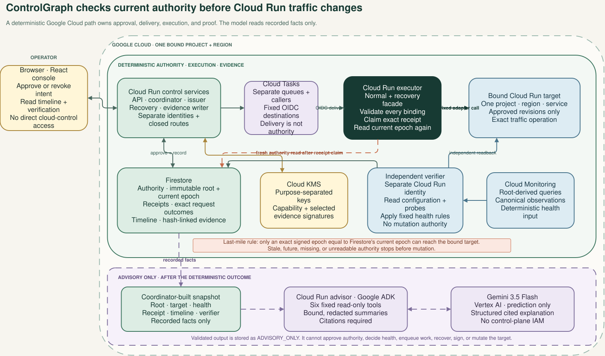

# Architecture

## Purpose

ControlGraph closes the gap between approval time and execution time. A queued request can still
have a valid caller and signature after an operator has withdrawn its authority. ControlGraph
therefore checks current authority immediately before the target change.

The implementation is intentionally narrow. It controls one Cloud Run canary in one project and
region. It captures a stable revision, applies a 90/10 split, evaluates fixed health rules, and
either promotes the candidate or restores the captured stable revision.

## Solution boundary



[Open the editable Draw.io source](assets/architecture.drawio).

The design has four responsibilities:

1. **Approve:** an operator creates one immutable rollout root. A separate epoch records whether
   authority for that root is still current.
2. **Execute:** signed capabilities and addressed tasks carry one approved action to a
   target-bound executor. The executor performs the final epoch check.
3. **Verify:** a separate read-only path observes configuration, traffic, probes, and Monitoring
   data. It determines whether the result matches the approved outcome.
4. **Explain:** the timeline presents recorded facts. The optional advisor can organize cited
   evidence, but it cannot change authority or traffic.

## Core control path

A protected mutation follows this order:

1. authenticate the caller for the route;
2. decode the request and verify its signature;
3. validate lineage, scope, target, action, plan, lifetime, precondition, and request bindings;
4. read current root authority;
5. claim the exact execution receipt;
6. read current authority again;
7. call the fixed target adapter once; and
8. record the result and obtain independent readback.

The second authority read is the last authorization operation before the provider call. The signed
epoch must equal the current epoch. A stale epoch, a future epoch, a missing record, or an
unavailable authority read stops the action.

The executor cannot accept an arbitrary project, region, service, image, URL, API method, or field
mask from the caller. Its adapter is configured for one target and one traffic operation.

## Root and epoch authority

The rollout root records the approved stable snapshot, candidate revision, traffic plan, health
policy, recovery limits, target, and maximum authority. Root content is immutable.

The epoch is a separate monotonically increasing authority version. Revocation advances that
version with an expected-current comparison. It does not rewrite the root or change traffic.

This separation gives queued work a simple execution rule:

- a matching epoch can proceed through the remaining gates;
- a lower epoch is stale and is denied; and
- a higher epoch is inconsistent and is denied.

Queue admission and capability issuance are not substitutes for this final check. The complete
decision is recorded in [ADR 0002](decisions/0002-execution-time-epoch-fencing.md).

## Capabilities and identity

Capabilities bind one caller, audience, target, root, epoch, action, revision, traffic plan,
provider precondition, request identity, and lifetime. A child capability must keep or narrow each
part of its parent's authority. Its lineage ends at the approved root.

Operator, API, coordinator, issuer, executor, recovery, verifier, evidence-writer, and task-caller
identities remain separate. Cloud Run IAM authenticates service invocation. Protected handlers
also validate Google-issued identity claims against their configured audience and caller policy.

Cloud KMS keeps the private signing keys. Capability signing and evidence signing use separate key
purposes and identities. Callers cannot select a key, algorithm, public-key URL, or trust bundle.

## Delivery and receipts

Cloud Tasks delivers commands to fixed private handlers with a configured OIDC caller and
audience. The queue provides delivery, not mutation authority.

Each request has a deterministic receipt identity. The identity binds the capability, root, epoch,
action, target, provider precondition, traffic plan, payload, and expected post-state. Exact
duplicates can adopt the same result. A request that reuses an identity for different work is
denied.

Only a directly confirmed fresh claim can create the process-local dispatch lease for one provider
attempt. Stored or adopted claims cannot recreate that permission.

## Verified outcomes

The verifier reads Cloud Run configuration and the target data path independently of the executor.
For health decisions, it also derives the admitted Cloud Monitoring queries from the rollout root
and applies the fixed policy to canonical observations.

The supported branches are:

- **Healthy:** consecutive healthy windows can authorize promotion to 100 percent candidate
  traffic.
- **Unhealthy:** terminal unhealthy evidence can create one recovery intent for 100 percent
  traffic on the captured stable revision.
- **Revoked:** delayed work from the prior epoch is denied. A separately confirmed recovery can
  use new authority to restore the captured stable revision.

Recovery has its own task caller, service, executor facade, and receipt route. The recovery service
validates and forwards stable-only work but has no direct target-update permission. The executor
repeats the root, receipt, prestate, target, and current-epoch checks before it admits recovery.

The exact state vocabulary and recovery-source rules are in the
[product contract](product-contract.md). Reproducible examples are in the
[acceptance cases](acceptance-cases.md).

## Uncertain provider outcomes

A timeout or lost response can leave the provider result unknown. ControlGraph records
`AMBIGUOUS`, performs no blind mutation retry, and uses exact readback to resolve what happened.
A proven provider rejection with no protected effect becomes `FAILED_SAFE`.

Completion requires agreement between intent, receipt, configuration, and required data-path
evidence. An executor response alone is not proof. This choice is recorded in
[ADR 0003](decisions/0003-independent-verification-and-ambiguity.md).

## Contracts and dependency direction

Every object that crosses a process, persistence, language, or trust boundary has a versioned,
closed representation. Signed and hashed content uses deterministic UTF-8 JSON, duplicate-key
rejection, fixed timestamp and number rules, unknown-field rejection, and domain-separated
digests.

The Python code depends inward:

```text
HTTP services and CLI        Google Cloud integrations
           \                         /
            \                       /
             application facade and ports
                         |
              contracts and authority kernel
```

The authority kernel is pure Python. It imports no HTTP framework, cloud SDK, model SDK, ADK, or
agent framework. Integrations implement narrow application ports. Optional agent integrations
receive no mutation-capable facade.

## Evidence and explanation

Selected authority, health, and independent-verification evidence is signed with the evidence key.
Capabilities use the separate capability key. Receipts, canonical digests, provider readback, and
the ordered hash-linked timeline bind the remaining effects.

The optional advisor reads a fixed set of recorded summaries through typed, read-only tools. Its
structured response must cite the evidence used for each factual finding. The response is stored
as `ADVISORY_ONLY` and never enters an authority, health, dispatch, recovery, or mutation decision.
See [ADR 0004](decisions/0004-advisory-model-boundary.md).

The public `/replay` route serves a bounded, redacted projection of one accepted run. The browser
validates the artifact, schema, payload, case bindings, image references, and event chain before it
renders. The authenticated evidence path, not the browser, verifies Cloud KMS signatures.

## Google Cloud mapping

| Responsibility | Implementation |
|---|---|
| Current root and epoch authority | Firestore |
| Capability and selected evidence signatures | Purpose-separated Cloud KMS keys |
| Addressed delivery | Separate Cloud Tasks queues and callers |
| Target mutation | Private Cloud Run executor with a fixed adapter |
| Health and target observation | Cloud Monitoring plus read-only Cloud Run and probe access |
| Operator presentation | Static React console through the authenticated API |
| Optional explanation | Separate Google ADK and Gemini integration with read-only tools |

Terraform defines the isolated project substrate, identities, queues, keys, storage, services,
monitoring, and disposable reference target. Infrastructure details remain in
[`infra/README.md`](../infra/README.md).

## Scope

ControlGraph does not replace Cloud Run, Cloud Deploy, IAM, KMS, Tasks, Monitoring, or provider
audit logs. It adds a closed authority and evidence path for the documented canary workflow. It is
not a general deployment, graph, workflow, or policy engine, and model output is never mutation
authority.

The [threat model](threat-model.md) records the trust assumptions and residual interval between the
final Firestore read and the Cloud Run call. The
[native-cloud comparison](native-cloud-comparison.md) shows which controls are inherited and which
behavior ControlGraph adds.
